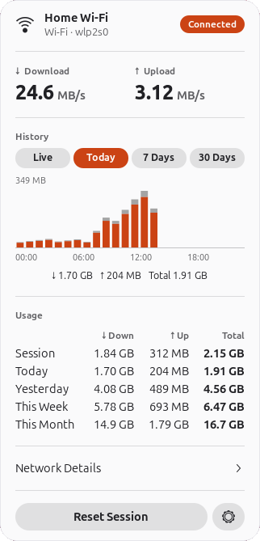
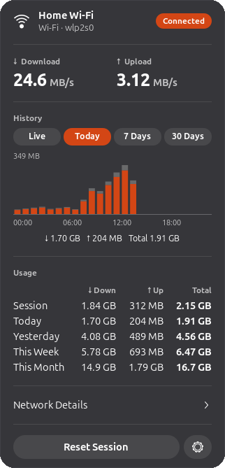
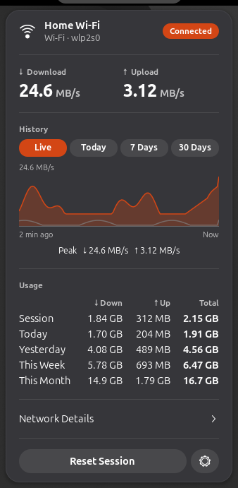
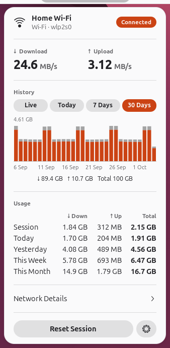
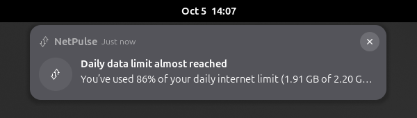
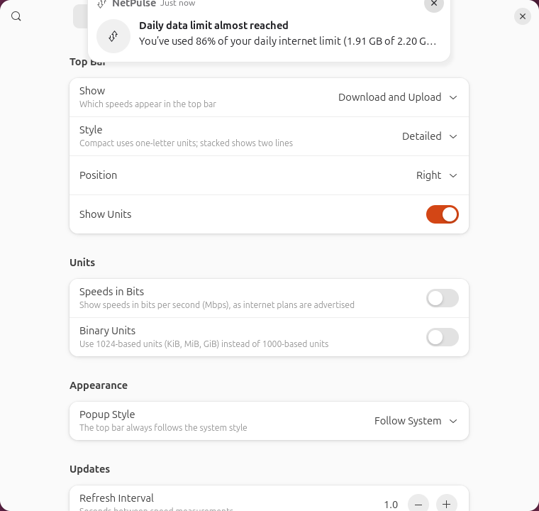
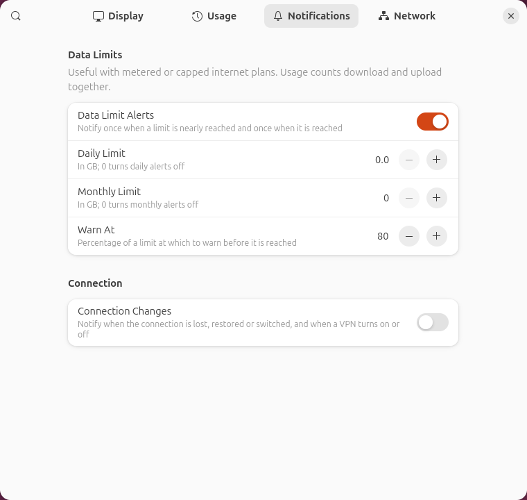

# NetPulse

> Real-time internet speed and usage monitoring for GNOME.

[](https://github.com/ammarqaisar11a55/NetPulse-GNOME-Shell-Extension/actions/workflows/ci.yml)
[](https://github.com/ammarqaisar11a55/NetPulse-GNOME-Shell-Extension/releases/latest)

[](LICENSE)

NetPulse is a GNOME Shell extension that shows your current download and
upload speed in the top bar and keeps track of how much data you use: per
session, day, week and month, with history charts and optional data limit
alerts. Everything stays on your computer.

<p align="center">
  
  &nbsp;&nbsp;
  
</p>

## Features

- **Real-time download and upload speed** in the top bar, in bytes or bits
  per second, without the panel jumping around as numbers change
- **Usage tracking** for the current session, today, yesterday, this week and
  this month, kept across restarts, crashes and reboots
- **History charts**: live speed for the last two minutes, and hourly or daily
  usage for today, the last 7 days and the last 30 days
- **Network details**: connection name or Wi-Fi network, type (Ethernet, Wi-Fi,
  USB tethering, mobile broadband, Bluetooth), interface, IP addresses and
  VPN status
- **Automatic interface detection** that follows switches between Wi-Fi,
  Ethernet and VPNs without speed spikes, or a fixed interface of your choice
- **Usage alerts** for daily and monthly data limits, and optional notifications
  when the connection drops, returns or changes
- **Light and dark styles** that follow GNOME and your accent color
- **Lightweight**: one timer reading two kernel counters per second, and the
  popup costs nothing until you open it

## Requirements

- **GNOME Shell 50**. Developed and tested on **Ubuntu 26.04 LTS**.
- `glib-compile-schemas` (package `libglib2.0-bin`, normally installed)
- NetworkManager is recommended (it provides connection names and
  connectivity), but not required: without it NetPulse reads the kernel's
  routing table.

## Installation

### From source

```bash
git clone https://github.com/ammarqaisar11a55/NetPulse-GNOME-Shell-Extension.git
cd NetPulse-GNOME-Shell-Extension
./install.sh
```

The script checks your GNOME Shell version and dependencies, builds the
extension bundle, installs it for your user into
`~/.local/share/gnome-shell/extensions/` and compiles its settings schema.
It never needs root.

Then make GNOME Shell load it and enable it:

- **Wayland** (default): log out and back in.
- **X11**: press <kbd>Alt</kbd>+<kbd>F2</kbd>, type `r` and press
  <kbd>Enter</kbd>.

```bash
gnome-extensions enable netpulse@ammarqaisar11a55.github.io
```

or switch it on in the **Extensions** app. `./install.sh --help` lists the
options.

### From a release

Download `netpulse@ammarqaisar11a55.github.io.shell-extension.zip` from the
[releases page](https://github.com/ammarqaisar11a55/NetPulse-GNOME-Shell-Extension/releases),
then:

```bash
gnome-extensions install --force netpulse@ammarqaisar11a55.github.io.shell-extension.zip
```

and log out and back in before enabling it as above.

### Uninstalling

```bash
./uninstall.sh            # keeps your usage statistics
./uninstall.sh --purge    # also deletes them and resets all settings
```

## Usage

### Top bar

The indicator shows the current download (↓) and upload (↑) speed. It dims
while there is no network connection. Several styles are available:

| Style | Example |
| --- | --- |
| Detailed (default) |  |
| Compact |  |
| Stacked |  |
| Detailed, in bits |  |

### Popup

Click the indicator to open the dashboard:

- **Header**: the network you are connected to, its type and interface, and
  whether it is connected, has limited connectivity or is offline.
- **Download / Upload**: the current speeds.
- **History**: choose **Live** (speed over the last two minutes), **Today**
  (per hour), **7 Days** or **30 Days** (per day). Hover over a bar to see its
  values; otherwise the line below shows the totals for the range.
- **Usage**: downloaded, uploaded and total data for the session, today,
  yesterday, this week and this month.
- **Network Details**: connection type, interface, IPv4/IPv6 address and VPN.
- **Reset Session** starts counting the session from zero; the gear button
  opens the preferences.

| Live speed | 30 days |
| --- | --- |
|  |  |

A *session* lasts from login to logout: locking the screen does not reset it.
Weeks start on the first day of the week of your locale.

### Alerts

With a data limit set, NetPulse warns once when usage reaches the alert
percentage and once when the limit is reached, per day or month:



## Settings

Open them from the popup's gear button, the Extensions app, or
`gnome-extensions prefs netpulse@ammarqaisar11a55.github.io`. Every change
applies immediately.

| Page | Setting | Default | Description |
| --- | --- | --- | --- |
| Display | Show | Download and Upload | Download and upload, only one of them, or their sum |
| | Style | Detailed | Detailed, compact (one-letter units) or stacked (two lines) |
| | Position | Right | Left, center or right part of the top bar |
| | Show Units | On | Show units next to the values in the top bar |
| | Speeds in Bits | Off | Mbps instead of MB/s, as internet plans are advertised |
| | Binary Units | Off | 1024-based units (KiB, MiB, GiB) instead of 1000-based |
| | Popup Style | Follow System | Follow GNOME's light/dark style, or always light or dark |
| | Refresh Interval | 1.0 s | How often speed is measured (0.5–10 s) |
| Usage | Track Data Usage | On | Record usage; when off, existing statistics are kept |
| | Keep History | 365 days | Days of daily history to keep (31–3650) |
| | Reset Statistics… | | Erase all recorded usage, after confirmation |
| Notifications | Data Limit Alerts | On | Alerts for the limits below |
| | Daily Limit | 0 (off) | Daily data limit in GB |
| | Monthly Limit | 0 (off) | Monthly data limit in GB |
| | Warn At | 80 % | Percentage of a limit at which to warn |
| | Connection Changes | Off | Notify when the connection drops, returns or changes, and about VPNs |
| Network | Detect Automatically | On | Follow the connection carrying your internet traffic |
| | Interface | | The interface to measure when detection is off |
| | Debug Logging | Off | Write detailed diagnostics to the system journal |

<p align="center">
  
  
</p>

## How it works

- **Speed** is the difference of the kernel's byte counters
  (`/sys/class/net/<interface>/statistics/rx_bytes` and `tx_bytes`) divided by
  the time between two readings. When the interface changes, measuring
  restarts from a new baseline, so switching never produces a spike.
- **The interface** is the one NetworkManager reports as carrying the default
  connection, or the kernel's default route without NetworkManager. Modern
  names such as `enp3s0` or `wlp2s0` are discovered, never hardcoded.
- **VPNs**: NetPulse keeps measuring the physical connection underneath and
  shows the VPN separately. Usage therefore matches what your provider sees
  (including VPN overhead), and switching a VPN on or off does not disturb
  the numbers.
- **Usage** is saved at most once a minute, and when you log out. Writes are
  atomic (a temporary file replaced in one step) and a daily backup is kept,
  so a crash or power loss cannot corrupt it. GNOME switches extensions off
  while the screen is locked; NetPulse catches up afterwards from the kernel
  counters, so traffic during that time (or before a crash) is still counted.

## Privacy

NetPulse works entirely locally. It makes no network requests, collects no
personal information and contains no analytics or telemetry. It only reads
traffic counters, never the traffic itself.

Usage statistics are stored only on your computer, readable by you alone, in
`~/.local/share/netpulse/usage.json` (with a daily backup next to it).
Settings are stored in GSettings (`org.gnome.shell.extensions.netpulse`).

## Troubleshooting

**The extension does not appear after installing.**
GNOME Shell only discovers new extensions when it starts. On Wayland, log out
and back in; on X11, restart the shell with <kbd>Alt</kbd>+<kbd>F2</kbd>, `r`.
Then check `gnome-extensions info netpulse@ammarqaisar11a55.github.io`.

**`install.sh` says my GNOME Shell version is not supported.**
NetPulse is built and tested for GNOME Shell 50. `./install.sh --force`
installs it anyway, but it may not work.

**The speed stays at 0 B/s.**
Open the popup and check the interface shown in the header. If it is not the
one you use (for example with unusual setups such as bridges or containers),
turn off *Detect Automatically* in the Network preferences and choose the
interface.

**Usage looks higher than in my provider's account.**
NetPulse measures everything sent and received on the connection, including
local network traffic and protocol overhead, and uses 1 GB = 1000³ bytes
unless Binary Units are on.

**Something else is wrong.**
Turn on *Debug Logging* in the Network preferences and watch the log:

```bash
journalctl -f -o cat /usr/bin/gnome-shell | grep NetPulse
```

Please include these lines when [opening an issue](https://github.com/ammarqaisar11a55/NetPulse-GNOME-Shell-Extension/issues).

## Development

### Project structure

```text
extension.js              enable/disable; wires the parts together
prefs.js                  preferences window
stylesheet.css            panel and popup styles (inherits theme colors)
metadata.json             extension metadata
schemas/                  GSettings schema
src/
  network/
    InterfaceMonitor.js   picks the interface to measure (NM or kernel)
    NMBackend.js          NetworkManager-based detection
    KernelBackend.js      /proc and /sys based detection
    InterfaceTypes.js     shared types and validation
    SpeedMonitor.js       samples counters, computes speeds
  usage/
    UsageTracker.js       accounts traffic per session/hour/day/month
    UsageStorage.js       atomic JSON persistence with backup
    UsageStatistics.js    period totals and series
    UsageAlerts.js        data limit thresholds
  ui/
    PanelIndicator.js     top bar button
    PopupDashboard.js     popup content
    SpeedDisplay.js, UsageDisplay.js, HistoryView.js, HistoryGraph.js, ...
  notifications/          notification source, limit and connection alerts
  prefs/                  preferences pages
  settings/               typed access to GSettings
  utils/                  formatting, logging, signals, files
tests/
  unit/                   unit tests (plain gjs)
  shell/scenarios/        integration tests against a headless GNOME Shell
  shell/netns/            network switching tests in a network namespace
  install/                installer tests
  live/                   probes for your real machine
tools/                    build, test and screenshot scripts
```

The network and usage modules don't import GNOME Shell code, so they can be
unit tested with plain `gjs`.

### Testing

```bash
tools/check.sh
```

runs everything, needing neither root nor your real session:

- **Unit tests** (`gjs -m tests/run.js`), with fake `/proc` and `/sys` trees
  for network detection.
- **Installer tests** in a throwaway home directory.
- **Headless GNOME Shell scenarios** (`tools/test-headless.sh`): a real GNOME
  Shell runs headless with a private D-Bus session, private XDG directories and
  a private runtime directory. The extension is installed with `install.sh`,
  and the scenarios check the panel, popup, usage persistence across
  restarts, crashes and file corruption, preferences (driven through the
  accessibility tree), notifications, light and dark styles (including text
  contrast), error handling and resource use.
- **Network switching** (`NETPULSE_NETNS=1 tools/test-headless.sh`): the same
  headless shell inside a private network namespace, where interfaces,
  routes and a WireGuard VPN come and go while real traffic flows.

Screenshots of each run land in `test-output/`. To look at your real
machine:

```bash
gjs -m tests/live/probe-network.js 60   # what is detected, and changes
gjs -m tests/live/probe-speed.js 30     # live speeds
```

### Releases

Pushing a version tag publishes a release through GitHub Actions
(`.github/workflows/release.yml`): it checks that the tag matches
`version-name` in `metadata.json`, runs the tests, builds the bundle and a
`SHA256SUMS` file, and takes the release notes from `CHANGELOG.md`.

```bash
git tag -a v1.0.0 -m "NetPulse 1.0.0"
git push origin v1.0.0
```

### Other tools

```bash
tools/build.sh            # build the installable zip into dist/
tools/screenshots.sh      # regenerate docs/screenshots with demo data
```

## Contributing

Contributions are welcome.

1. Open an issue first for larger changes, so we can agree on the approach.
2. Keep to the existing style: small modules, ES modules, GJS conventions,
   comments that explain *why*.
3. Add or update tests for your change, and make sure `tools/check.sh` passes.
4. Use [Conventional Commits](https://www.conventionalcommits.org/) messages
   (`feat:`, `fix:`, `docs:`, ...).
5. Keep NetPulse private: no network requests, telemetry or new runtime
   dependencies.

User-facing strings are translatable (`gettext` domain `netpulse`);
translations are welcome too.

## License

GPL-2.0-or-later. See [LICENSE](LICENSE).
